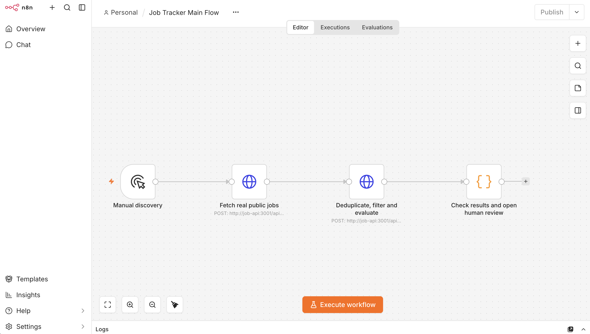
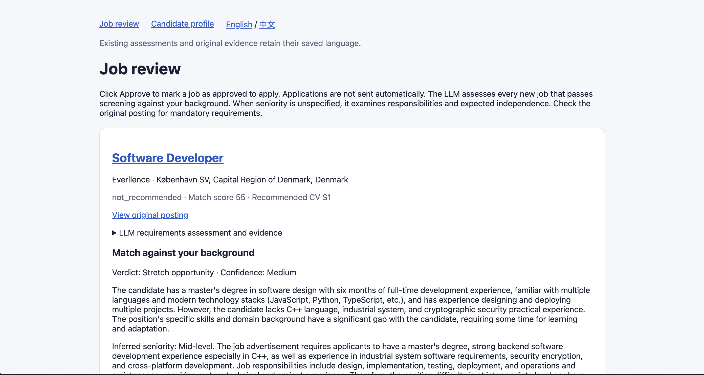
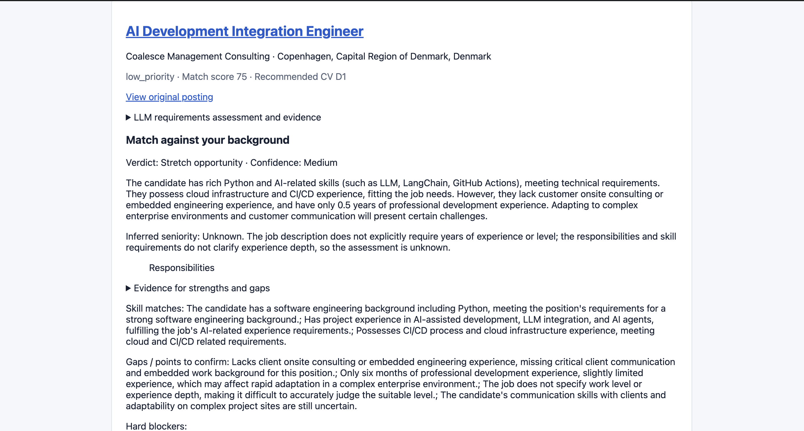
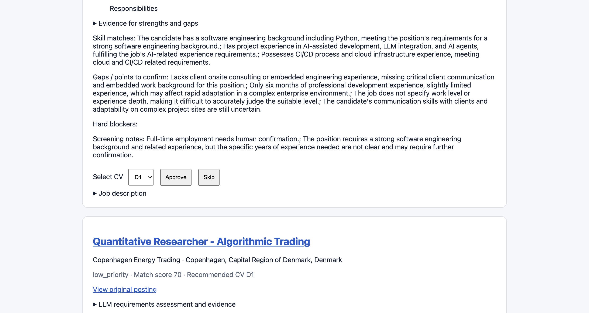

# n8n Job Tracker

**n8n Job Tracker is a local job discovery and screening tool for early-career software, data and AI candidates looking for work in Denmark.** It brings recent LinkedIn postings into one review page, removes jobs that conflict with your requirements, and uses an LLM to assess the remaining opportunities against your actual CV background. The goal is to reduce the time spent opening unsuitable postings and help you decide which jobs are worth applying to.

The default search targets full-time roles in Copenhagen published within the last **3 days (72 hours)**. You start discovery manually through n8n; the system fetches public job descriptions, skips jobs already processed, and saves results in PostgreSQL. Every new job that passes initial screening receives a background assessment using your saved skills, professional experience, projects, education, language levels and work authorization.

For each retained job, the review page shows a **0–100 match score**, a suitability verdict, an inferred seniority level, strengths, gaps and supporting evidence from the job description and candidate background. You make the final decision: open the original posting, review the evidence, choose a CV, and **approve or skip** the job.

The application runs locally with Docker Compose, n8n, a Node.js API and PostgreSQL, and supports a configurable OpenAI-compatible LLM endpoint.

## Screenshots

### n8n workflow

Manual discovery connects public job search, screening and LLM evaluation to human review.



### Job review

Review job scores, recommended CVs and assessments. The interface supports English and Chinese, with English as the default.



### Background assessment

Each eligible new job is assessed against the saved candidate background, with a suitability verdict, inferred seniority, strengths and gaps.



### Human review actions

Inspect screening notes, select a CV, and approve or skip a job. Approval records the decision without sending an application.



## Run

Copy `.env.example` to `.env` and set your own database password and n8n encryption key before starting:

```bash
cp .env.example .env
docker compose up -d --build
```

- n8n: http://localhost:5678 (create an owner account on first launch)
- Human review: http://localhost:3001/review
- Candidate profiles: http://localhost:3001/profile

Import `workflows/job-tracker-main.json` into n8n, then open **Job Tracker Main Flow** and click **Execute Workflow**. The workflow has only a manual trigger. Search is restricted to the last 3 days (72 hours), ordered newest first; records without a verifiable publication date are omitted. Each request returns up to 25 jobs (the public source commonly returns 10). `node --import tsx scripts/discover-recent.ts` manually walks up to 20 pages and evaluates new jobs, advancing by the actual result count. The search node accepts `keywords`, `location`, `page` (1–20), and `limit` (1–25).

The API is part of Compose; a separate `npm run api` is unnecessary. HTTP requests use `http://job-api:3001` within Docker. Ports bind to localhost.

## Processing

1. Fetch actual publicly accessible LinkedIn search cards, without login.
2. Deduplicate by stable external id before fetching descriptions. Existing completed records are skipped; failed records can be retried. A PostgreSQL advisory lock prevents concurrent processing of the same job.
3. Commit the raw search record before any detail fetch or evaluation.
4. Fetch the public description and employment type. Requests are serialized with a minimum 1.5-second interval; rate/server errors honor Retry-After with one bounded retry. Network/verification failures are reported and persisted, never replaced by sample data.
5. Filter roles outside Denmark, roles outside software/data/AI, and explicitly part-time roles. Contract/temporary roles require confirmation when full-time status is unknown. Senior roles, student jobs/current-enrollment requirements, and explicit minimum experience requirements of 3 years or more are hard exclusions. With LLM enabled, semantic interpretation distinguishes the actual role from references to colleagues or company history. Unknown employment type is flagged for human confirmation.
6. Parse explicit skills, language requirements and experience. Score against real saved candidate profiles, with 70 skill points, 20 role-family points and 10 experience points, normalized by available evidence. Missing experience/language information is flagged. Declared Danish A2 does not satisfy required fluency.
7. Persist parsed JD, fit score, blockers, gaps and an audit event using bound SQL parameters and an atomic update. Failed jobs cause the final n8n node to fail visibly; successful jobs remain saved.
8. Open the review page, choose a CV, then approve or skip. Approval atomically saves `approved_to_apply`, selected CV, review/approval timestamps and an audit event. No application is sent. Repeated decisions are rejected.

With background assessment enabled, the fit score and suitability judgment come from the LLM comparing the full JD with real saved background. Rule-only mode uses a deterministic skill score. Requirement judgments and fit judgments persist exact supporting quotes.

## Candidate data and database migration

Existing deployments need the additive migration once:

```bash
docker compose exec -T postgres sh -c 'psql -v ON_ERROR_STOP=1 -U "$POSTGRES_USER" -d "$POSTGRES_DB"' < db/migrate.sql
```

`npm run jobs:reevaluate` refreshes unreviewed jobs after profile or parser updates, preserving approved/skipped decisions.


## Development and validation

```bash
npm ci
npm run typecheck
npm test
npm run test:integration # requires the local database and saved A1/S1 profiles
npm run build
```

`npm run dev` performs real discovery and persistence; `npm run api` starts a development API and requires port 3001 to be free. PostgreSQL initialization is in `db/init.sql`. Existing `.env` values and n8n encryption keys are retained.

## LLM requirement assessment

Configure `.env` (never put the key into workflow JSON):

```dotenv
LLM_ENABLED=true
LLM_FIT_ENABLED=true
LLM_BASE_URL=https://api.openai.com/v1
LLM_MODEL=gpt-4.1-mini
LLM_API_KEY=your_private_key
LLM_TIMEOUT_MS=40000
```

For another OpenAI-compatible provider, change the base URL/model/key. The URL must be the base before `/chat/completions`. Recreate the API with `docker compose up -d --build job-api` after changes. Requirement assessment sends public job title, employment type and JD to the provider. With `LLM_FIT_ENABLED=true`, every job passing the hard filter additionally sends the merged candidate skills, professional development duration/experience, projects, education, language levels and work authorization to the provider. Names, employer names, contact fields and project URLs are omitted. Enable background assessment only after authorizing this disclosure to the configured provider.

Judgments, model name and exact source quotes are saved in `jobs.requirement_analysis` and shown in the review page. A hash of model, prompt version and source input avoids duplicate calls on reevaluation. Run `npm run jobs:reevaluate` to reassess existing unreviewed jobs, including previously filtered records; approved/skipped decisions are preserved. API `/health` reports whether LLM configuration is active without exposing credentials. `LLM_ENABLED=false` explicitly restores rule-only mode; `auto` enables LLM only when all three settings are present.

## Background fit assessment

`LLM_FIT_ENABLED=true` enables the second assessment for EVERY newly discovered job that passes initial requirements, including jobs with no rank or minimum years stated. The LLM considers all saved CV variants together, distinguishes academic/project work from professional experience, and classifies suitable/stretch/unsuitable/uncertain with confidence, a holistic score, inferred level, JD quotes and candidate evidence. Missing seniority is never assumed junior. Implied responsibility/seniority mismatches are explained without inventing mandatory years.


`POST /api/agents/evaluate-fit` now accepts `{ "job": <raw job>, "profiles": [<saved profile objects>] }` to provide the complete JD and real background for the judgment, rather than keyword-only parsed skills.

 After scoring, scores below 40 (strictly less than 40) are hard-excluded and hidden; their score and assessment remain stored for audit.
